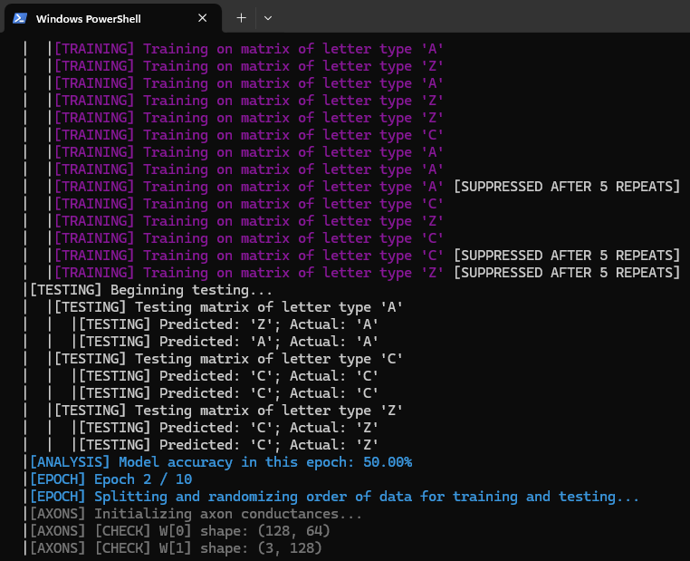

# Ganim Medical | Codebase Conventions

We will be using `Python` as our language solely for the purpose of this documentation page.

## Naming conventions

* We use snake_case naming rather than CamelCase as much as possible.  For example, in the case of establishing a Python list:

```
ganimEmployees = [...] # This is incorrect
ganim_employees = [...] # This is correct
```

* Functions should start with an uppercase letter, whereas variables should start with a lowercase letter.
* If a function or variable includes an acronym, there should be a same-line comment containing the name in full that the acronym stands for.
* If a function or variable name is in any way ambiguous, there should be a same-line comment explaining its purpose.

## Debug logging conventions

Use custom logging functions such that they satisfy the requirements below:

* There must be a parameter you can enable/disable to enable/disable log visibility if log visibility is enabled by default in a product accessible to non-developers.
* There must be a parameter establishing a limit for repeat logs.  For instance, if the parameter is set to 3, then after the same string is logged 3 times, the system will suppress further messages with the same log string.
* There should be a global parameter that you can adjust to ensure logs are printed accurately with respect to the nesting level of the code—e.g., if you have a for-loop nested within a for-loop, the logs should be properly indented to reflect the nesting level of the code being reviewed.
* If you are working within a large-scale scalable framework, logs should be assigned color codes basedd on their purposes.

These steps make debug

For reference, see how a `Python` debug script was set up [here](https://github.com/gabetucker2/NNLetterViz/blob/main/debug.py), how the tuning parameters were set up in the `misc` section [here](https://github.com/gabetucker2/NNLetterViz/blob/main/param_configs/params_test.py) (although it does not have a log visibility boolean), and how it was implemented [here](https://github.com/gabetucker2/NNLetterViz/blob/main/model.py).

The final product, after applying the aforementioned principles, should look something like this:



## Function conventions

### Function precondition tests and exceptions

* Functions must tests for all possible invalid arguments, unless doing so is computationally expensive.  For example, a square root function which does not handle imaginary numbers must ensure the argument is not a negative real number before proceeding with function logic.  In `Python`, it could look like this:

```
def square_root(x):

    # Preconditions
    assert isinstance(x, (int, float)), "x must be an int or float"
    assert x >= 0, "x must be non-negative"
    
    # Logic
    ... # Take the square root here

```

### Function documentation

*TBA*

## Modularity, outsourcing, and minimalism

* Functions should, as a rule of thumb (and without discarding pragmatism), be broken into individual parts.  In a large-scale project, there should be various scripts solely dedicated to providing helper functions not already provided by the language.  Having many scripts with clearly defined purposes, even if these scripts are short, should be *strongly* prioritized over maintaining a few long scripts.  Each script should have one single purpose in the scheme of the project (e.g., a math function script, a parameter script, a an environment initialization script, a script that establishes a network connection, etc), and if a script has multiple purposes then this is a sign that proper delineation of responsibilities is lacking.
* Static variables should be *highly* centralized, ideally to scripts specifically dedicated to storing variables.
